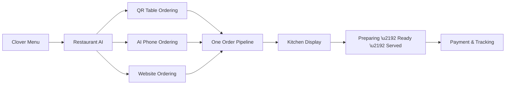
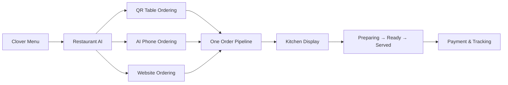

# Goutham Vemula

**AI Engineer | LLM Application Developer**

---

AI Engineer with 6+ years building production software, now focused on shipping LLM-powered applications. I design RAG pipelines, AI voice and chat agents, and tool-calling integrations using OpenAI, Anthropic Claude, and Google Gemini. Founder of [Vector Wrap LLC](https://github.com/Gramv) — an AI product studio building conversational and voice-AI agents for hospitality and retail.

---

## Currently Building — SommelierAI

An AI voice and chat agent platform for restaurants, built on top of Clover POS. Customers order through QR codes, phone calls, or the web — every order flows into one unified kitchen system.

**Key capabilities:**

- **AI Phone Ordering** — Voice agent answers calls, takes takeout orders, books reservations (Google Gemini Live + Twilio + Deepgram)
- **QR Table Ordering** — Guests scan, ask natural questions ("What's vegetarian?"), and order from their phone
- **Group Ordering** — Shared carts where friends order from their own devices, host reviews and submits
- **Kitchen Display System** — Color-coded tickets, station routing, course firing, 86 board
- **Menu Intelligence** — RAG-powered recommendations with hybrid (dense + keyword) search over wine/varietal knowledge base
- **Waiter Tools** — Real-time notifications for orders, check requests, food ready alerts
- **Reservations** — Capacity-aware booking with conflict detection
- **Bilingual** — Full English + Spanish across all channels

`4 pilot restaurants configured` · `Clover POS developer integration approved` · `Bilingual voice agents`

---

## Featured Projects

### AI Document Intelligence Platform — Hotel Onboarding

Built for LakeCrest. Digitized paper-based hotel employee onboarding with AI-powered document processing, automating federal forms (I-9, W-4) and cutting per-employee admin time from hours to minutes.

`50,000+ LOC` · `245+ API endpoints` · `40+ database tables` · `Production on AWS`

- OCR + LLM pipeline auto-extracts and validates data from uploaded IDs (driver's license, passport, SSN card)
- LLM-powered field auto-fill, validation, and bilingual (EN/ES) support across 16-step onboarding portal
- Field-level encryption for PII (SSN, bank details), Secrets Manager, token-based auth, full audit logging
- AWS: ECS Fargate, RDS PostgreSQL, S3 with KMS, ALB, CloudWatch (9 alarms), Terraform IaC

---

### OTCMed Assist — AI Medical Assessment

AI symptom-assessment app with Groq LLM integration. Dynamic age-specific questionnaire, AI-powered visual symptom detection from images, and personalized safety-checked medication guidance with generated medical reports.

---

### Flyerbot — Restaurant Content Generator

AI-powered content and image generator for restaurant events, promotions, and marketing materials.

---

### Store Management System — Retail Platform

Full-stack Flask + PostgreSQL retail platform with multi-role authentication, automated sales reconciliation, dual supplier-ordering workflows, and Chart.js analytics dashboard.

---

## Tech Stack

**AI & LLMs**

**Languages & Frameworks**

**Infrastructure & Data**

---

## GitHub Stats

  
   
  

---

  
  
  

# Goutham Vemula

**Full-Stack Engineer | AI Products for Hospitality**

---

I build AI-powered products that solve real operational problems in the restaurant and hospitality industry. Currently focused on [SommelierAI](https://sommelierai.com) — a multi-channel restaurant platform that turns a Clover POS into an AI-driven ordering and operations system.

---

## Currently Building — SommelierAI

A single AI operating layer around Clover POS. Customers order through QR codes, phone calls, or the web — every order flows into one unified kitchen system.

**What it does:**

- **AI Phone Ordering** — Voice agent "Jamie" answers calls, takes takeout orders, books reservations via Twilio + Deepgram
- **QR Table Ordering** — Guests scan, browse, ask questions ("What is vegetarian?"), and order from their phone
- **Group Ordering** — DoorDash-style shared carts where friends order from their own devices
- **Kitchen Display System** — Color-coded tickets, station routing, course firing, 86 board
- **Waiter Tools** — Real-time notifications for new orders, check requests, food ready alerts
- **Menu Intelligence** — AI-generated dietary tags, allergen detection, food & wine pairings, upsell suggestions
- **Reservations** — Capacity-aware booking with automatic conflict detection
- **Bilingual** — Full English + Spanish support across all channels

---

## Featured Projects

### Hotel Employee Onboarding System

Enterprise-grade digital onboarding platform for the hospitality industry. Replaces paper-based I-9, W-4, and benefits enrollment with a mobile-first, bilingual digital experience.

`50,000+ LOC` · `245+ API endpoints` · `40+ database tables` · `Production on AWS`

- QR code recruitment → 7-step job application → 16-step onboarding portal → sequential manager approval# Goutham Vemula

**Full-Stack Engineer | AI Products for Hospitality**

---

I build AI-powered products that solve real operational problems in the restaurant and hospitality industry. Currently focused on [SommelierAI](https://sommelierai.com) — a multi-channel restaurant platform that turns a Clover POS into an AI-driven ordering and operations system.

---

## Currently Building — SommelierAI

A single AI operating layer around Clover POS. Customers order through QR codes, phone calls, or the web — every order flows into one unified kitchen system.

**What it does:**

- **AI Phone Ordering** — Voice agent "Jamie" answers calls, takes takeout orders, books reservations via Twilio + Deepgram
- **QR Table Ordering** — Guests scan, browse, ask questions ("What is vegetarian?"), and order from their phone
- **Group Ordering** — DoorDash-style shared carts where friends order from their own devices
- **Kitchen Display System** — Color-coded tickets, station routing, course firing, 86 board
- **Waiter Tools** — Real-time notifications for new orders, check requests, food ready alerts
- **Menu Intelligence** — AI-generated dietary tags, allergen detection, food & wine pairings, upsell suggestions
- **Reservations** — Capacity-aware booking with automatic conflict detection
- **Bilingual** — Full English + Spanish support across all channels

---

## Featured Projects

### Hotel Employee Onboarding System

Enterprise-grade digital onboarding platform for the hospitality industry. Replaces paper-based I-9, W-4, and benefits enrollment with a mobile-first, bilingual digital experience.

`50,000+ LOC` · `245+ API endpoints` · `40+ database tables` · `~$92/mo AWS cost`

- QR code recruitment → 7-step job application → 16-step onboarding portal → sequential manager approval
- Federal form compliance (I-9 with 3-day deadline tracking, W-4) with digital signatures
- OCR document processing, field-level encryption (SSN, bank accounts)
- Full AWS infrastructure: ECS Fargate, RDS PostgreSQL, S3, CloudWatch, ALB, Terraform IaC

---

### Flyerbot

AI-powered content and image generator for restaurant events, promotions, and marketing materials.

---

### MedAssist

AI companion for safe, personalized over-the-counter medication guidance.

---

## Tech Stack

**Languages & Frameworks**

**Data & Infrastructure**

**AI & Voice**

---

## GitHub Stats

  
   
  

---

  
  

